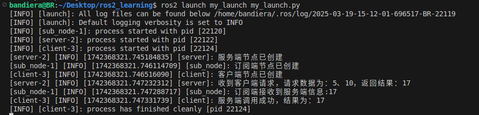

# 初音未来战队3.16小作业

## 思路

### 1.使用自定义服务消息接口AddInts.srv，其中包含客户端数据num1、num2与服务端数据sum。

### 2.使用yaml配置文件par.yaml，其中包含server节点参数param1，client节点参数param2、param3。

### 3.使用服务通信，客户端client从yaml中读取两个参数并发送请求至服务端server，服务端从yaml中读取一个参数，将其接受到的请求数据相加，并通过话题通信发送至sub话题，由从上一次作业中复用的sub_node接收。

（其实是因为没能太明白launch调用其他功能包节点是什么意思，故此处再加入了话题通信）

## 启动

```bash
colcon build
ros2 launch my_launch my_launch.py
```

启动成功后效果如图：


